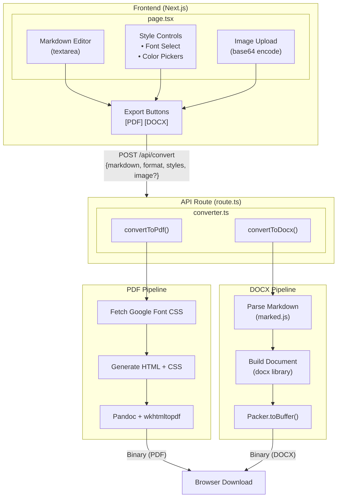
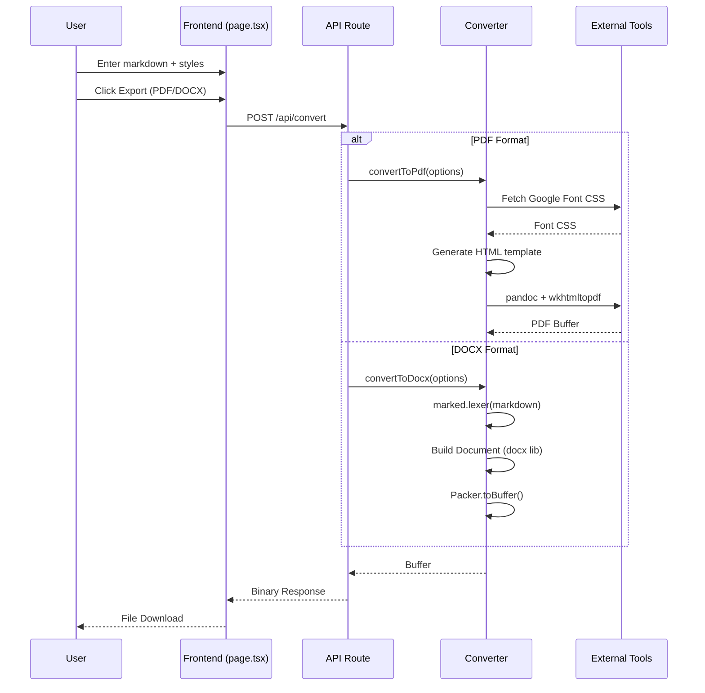

# Markdown to PDF/DOCX Converter

A Next.js proof-of-concept application that converts Markdown documents to both PDF and DOCX formats with **identical custom styling**. Users can customize fonts (via Google Fonts API), heading colors, and embed images.

## Features

- Markdown editor with live preview
- Export to PDF and DOCX with matching styles
- Google Fonts integration (10 popular fonts)
- Custom colors for H1 (primary) and H2 (secondary) headings
- Image upload with placeholder system
- Server-side conversion

## Architecture

### System Overview



### Conversion Flow



## How It Works

### PDF Generation

1. **Fetch Google Font CSS** - The selected font's CSS is fetched from Google Fonts API with font weights 400-700
2. **Generate HTML Template** - A complete HTML document is generated with embedded CSS styles:
   - Font family applied to all text elements
   - Primary color for H1 headings
   - Secondary color for H2/H3 headings
   - Code blocks, blockquotes, tables styling
3. **Process Markdown** - Image placeholders are replaced with base64 data URIs
4. **Convert with Pandoc** - Uses wkhtmltopdf as the PDF engine with options:
   - `--enable-local-file-access` for local resources
   - `--no-stop-slow-scripts` for font loading
   - `--javascript-delay 1000` to wait for fonts
   - Custom margins (25mm all sides)

### DOCX Generation

1. **Parse Markdown** - Uses `marked.js` to tokenize markdown into AST
2. **Build Document Programmatically** - Uses `docx` library to create:
   - Paragraphs with font family and size
   - Headings with custom colors (primary/secondary)
   - Lists with bullets
   - Code blocks with monospace font and shading
   - Blockquotes with italic styling
   - Images with base64 data
3. **Pack to Buffer** - Uses `Packer.toBuffer()` to generate the DOCX binary

## Tech Stack

| Component       | Technology              |
| --------------- | ----------------------- |
| Framework       | Next.js 15 (App Router) |
| Language        | TypeScript              |
| Styling         | Tailwind CSS            |
| PDF Engine      | Pandoc + wkhtmltopdf    |
| DOCX Engine     | docx (npm)              |
| Markdown Parser | marked                  |
| Fonts           | Google Fonts API        |

## Prerequisites

### System Dependencies

**macOS:**

```bash
brew install pandoc wkhtmltopdf
```

**Ubuntu/Debian:**

```bash
sudo apt-get install pandoc wkhtmltopdf
```

**Windows:**

```powershell
choco install pandoc wkhtmltopdf
```

Verify installation:

```bash
pandoc --version
wkhtmltopdf --version
```

## Installation

```bash
# Clone the repository
git clone <repository-url>
cd multi-docs-demo

# Install dependencies
pnpm install

# Start development server
pnpm dev
```

Open [http://localhost:3000](http://localhost:3000)

## Project Structure

```
multi-docs-demo/
├── src/
│   ├── app/
│   │   ├── api/
│   │   │   └── convert/
│   │   │       └── route.ts      # POST endpoint for conversion
│   │   ├── layout.tsx            # Root layout
│   │   ├── page.tsx              # Main UI with editor
│   │   └── globals.css           # Global styles
│   └── lib/
│       └── converter.ts          # PDF/DOCX conversion logic
├── templates/
│   └── pdf-template.html         # Legacy PDF template
├── package.json
└── README.md
```

## API Reference

### POST `/api/convert`

Converts markdown to PDF or DOCX format.

**Request Body:**

```typescript
{
  markdown: string;           // Markdown content
  format: 'pdf' | 'docx';     // Output format
  styles: {
    fontFamily: string;       // Google Font name (e.g., "Inter")
    primaryColor: string;     // H1 color in hex (e.g., "#1e3a5f")
    secondaryColor: string;   // H2 color in hex (e.g., "#2d5a87")
  };
  image?: {                   // Optional image
    base64: string;           // Base64-encoded image data
    mimeType: string;         // MIME type (e.g., "image/png")
  };
}
```

**Response:**

- `200 OK` - Binary file (PDF or DOCX)
- `400 Bad Request` - Missing required fields
- `500 Internal Server Error` - Conversion failed

**Headers:**

```
Content-Type: application/pdf
           or application/vnd.openxmlformats-officedocument.wordprocessingml.document
Content-Disposition: attachment; filename="document.pdf" (or .docx)
```

## Available Fonts

The following Google Fonts are available:

| Font             | Style                          |
| ---------------- | ------------------------------ |
| Inter            | Sans-serif, modern             |
| Roboto           | Sans-serif, Google's signature |
| Open Sans        | Sans-serif, highly readable    |
| Lato             | Sans-serif, warm               |
| Montserrat       | Sans-serif, geometric          |
| Poppins          | Sans-serif, geometric          |
| Source Sans 3    | Sans-serif, Adobe              |
| Nunito           | Sans-serif, rounded            |
| Playfair Display | Serif, elegant                 |
| Merriweather     | Serif, traditional             |

## Image Placeholder

To include an image in your document, add this placeholder in your markdown:

```markdown
[IMAGE_PLACEHOLDER]
```

Then upload an image using the UI. The placeholder will be replaced with the uploaded image in both PDF and DOCX outputs.

If no image is uploaded, the placeholder is automatically removed from the output.

## Usage Example

1. Enter or paste your markdown content in the editor
2. Select a font from the dropdown
3. Choose colors for H1 and H2 headings using the color pickers
4. (Optional) Upload an image and add `[IMAGE_PLACEHOLDER]` where you want it
5. Click **Export PDF** or **Export DOCX**
6. The file downloads automatically

## Limitations

- **Font Rendering**: Some complex fonts may not render identically between PDF and DOCX
- **Tables**: Basic table support in DOCX; complex tables may need adjustment
- **Code Highlighting**: Syntax highlighting not included (monospace only)
- **Page Breaks**: No explicit page break control
- **Headers/Footers**: Not implemented in this POC
- **Nested Lists**: Single-level lists only in DOCX

## Docker Deployment

```dockerfile
FROM node:20-alpine

# Install system dependencies
RUN apk add --no-cache \
    pandoc \
    wkhtmltopdf \
    fontconfig \
    ttf-freefont

WORKDIR /app

COPY package.json pnpm-lock.yaml ./
RUN npm install -g pnpm && pnpm install --frozen-lockfile

COPY . .
RUN pnpm build

EXPOSE 3000
CMD ["pnpm", "start"]
```

## Troubleshooting

### "pandoc: command not found"

Install Pandoc using your system's package manager (see Prerequisites).

### "wkhtmltopdf: command not found"

Install wkhtmltopdf using your system's package manager (see Prerequisites).

### Fonts not rendering in PDF

- Ensure wkhtmltopdf has network access to fetch Google Fonts
- Check that `--javascript-delay` is sufficient (increase if needed)
- Verify the font name matches exactly (case-sensitive)

### DOCX colors not applying

- Ensure hex colors include the `#` prefix in the UI
- The converter strips `#` internally for the docx library

### Images not appearing

- Verify the image is properly base64-encoded
- Check the `[IMAGE_PLACEHOLDER]` text is exactly as shown (case-insensitive)
- Supported formats: PNG, JPEG, GIF, WebP

## Future Improvements

- [ ] Add more Google Fonts options
- [ ] Custom font upload support
- [ ] Multiple image placeholders
- [ ] Table of contents generation
- [ ] Page headers and footers
- [ ] Syntax highlighting for code blocks
- [ ] Custom page sizes (A4, Letter, etc.)
- [ ] Watermark support
- [ ] Batch conversion API

## License

MIT
